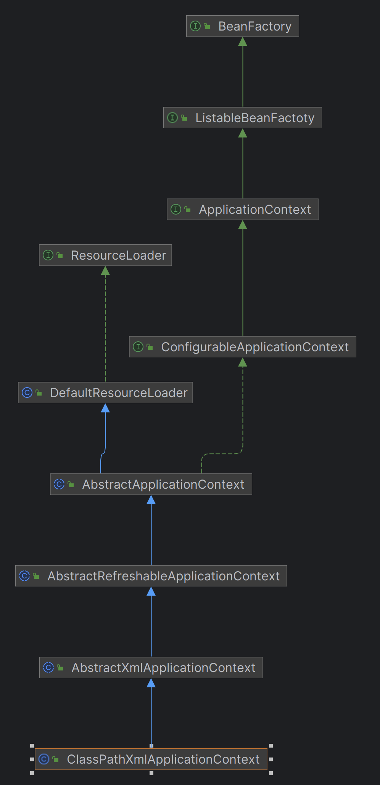

# spring framework


```xml

<beans xmlns:context="http://www.springframework.org/schema/context"
       xmlns:xsi="http://www.w3.org/2001/XMLSchema-instance"
       xsi:schemaLocation="http://www.springframework.org/schema/context ">

    <bean class="org.eintr.springframework.beans.factory.PropertyPlaceholderConfigurer">
        <property name="location" value="classpath:token.properties"/>
    </bean>

    <bean id="conversionService" class="org.eintr.springframework.context.support.ConversionServiceFactoryBean"/>

    <context:component-scan base-package="org.eintr.springframework.test.bean"/>
    <context:component-scan base-package="org.eintr.springframework.test.event"/>
    <context:component-scan base-package="org.eintr.springframework.test.common"/>
    <bean id="interceptor" class="org.eintr.springframework.test.bean.UserServiceInterceptor"/>
    <bean id="pointcutAdvisor" class="org.eintr.springframework.aop.aspectj.AspectJExpressionPointcutAdvisor">
        <property name="expression" value="execution(* org.eintr.springframework.test.bean.IUserService.*(..))"/>
        <property name="advice" ref="interceptor"/>
    </bean>

</beans>

```

```java

public void test_xml() {
    // 1.初始化 BeanFactory
    ClassPathXmlApplicationContext applicationContext = new ClassPathXmlApplicationContext("classpath:spring.xml");
    applicationContext.registerShutdownHook();

    // 2. 发布一个事件
    applicationContext.publishEvent(new CustomEvent(applicationContext, 114514L, "事件响应"));

    // 3. 用一个类实现一个接口
    IUserService userService = applicationContext.getBean("userService", IUserService.class);
    String result = userService.queryUserInfo("AAA");
    System.out.println("测试结果：" + result);
}

```

1. ClassPathXmlApplicationContext



```java

/*
1 加载XML
2 修改Bean定义
3 注册Bean扩展
4 初始注册事件
5 实例化单例Bean对象
6 容器已经加载完毕 发布容器
 */
@Override
public void refresh() throws BeansException {
    refreshBeanFactory(); // 创建 BeanDenifition 并加载

    ConfigurableListableBeanFactory beanFactory = getBeanFactory(); // 获取BeanFactory

    // 添加ApplicationContextAwareProcessor
    // 让继承自ApplicationContxtAwareProcessor的Bean对象都能感知所属的ApplicationContext
    beanFactory.addBeanPostProcessor(new ApplicationContextAwareProcessor(this));

    invokeBeanFactoryPostProcessors(beanFactory); // 执行类信息后处理函数

    registerBeanPostProcessors(beanFactory); // 注册实例信息后处理函数

    initApplicationEventMulticaster(); // 初始化事件发布者

    registerListeners();// 初始化事件监听器

    // 设置类型转换器、提前实例化单例Bean对象
    finishBeanFactoryInitialization(beanFactory);

    finishRefresh(); // 发布容器 刷新完成事件
}

```

- refreshBeanFactory(); // 创建 BeanDenifition 并加载

```java

protected void doLoadBeanDenifitions(InputStream inputStream) throws ClassNotFoundException, DocumentException {
        // ...
    
		// 解析 context:component-scan 标签，扫描包中的类并提取相关信息，用于组装 BeanDefinition
		List<Element> components = root.elements("component-scan");
		for (Element component : components) {
                // ...
				scanPackage(scanPath);
		}

		// 默认实现AOP
		getRegistry().registerBeanDefinition(
				StrUtil.lowerFirst(DefaultAdvisorAutoProxyCreator.class.getSimpleName()),
				new BeanDefinition(DefaultAdvisorAutoProxyCreator.class));

		List<Element> beanList = root.elements("bean");
		for (Element bean : beanList) {

			String id = bean.attributeValue("id");
			String name = bean.attributeValue("name");
			String className = bean.attributeValue("class");
			String initMethod = bean.attributeValue("init-method");
			String destroyMethodName = bean.attributeValue("destroy-method");
			String beanScope = bean.attributeValue("scope");

            // ...

			/*
			 * 1. 定义bean
			 * 2. 填充bean的属性
			 * 3. 检查是否重复定义bean
			 * 4. 注册该bean
			 * */
			BeanDefinition beanDefinition = new BeanDefinition(clazz);
			beanDefinition.setInitMethodName(initMethod);
			beanDefinition.setDestroyMethodName(destroyMethodName);

			if (StrUtil.isNotEmpty(beanScope)) {
				beanDefinition.setScope(beanScope);
			}

			List<Element> propertyList = bean.elements("property");
			// 读取属性并填充
			for (Element property : propertyList) {
				// 解析标签：property ...
			}
            
			if (getRegistry().containsBeanDefinition(beanName)) {
				throw new BeansException("Duplicate beanName[" + beanName + "] is not allowed");
			}
			// 注册 BeanDefinition
			getRegistry().registerBeanDefinition(beanName, beanDefinition);
		}
	}

```


